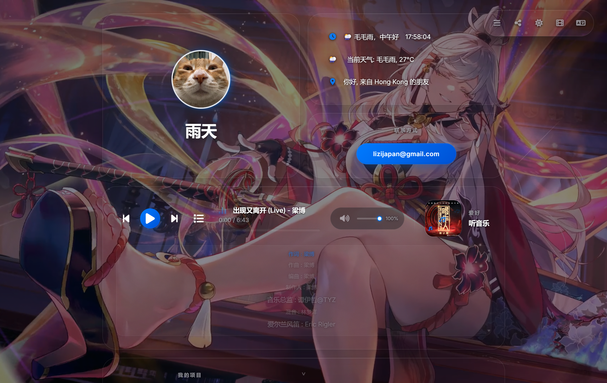
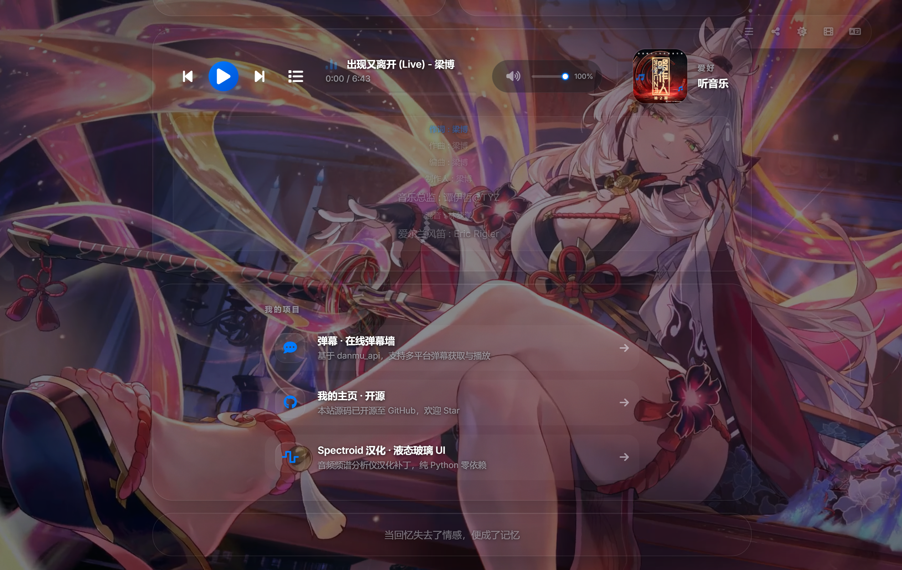
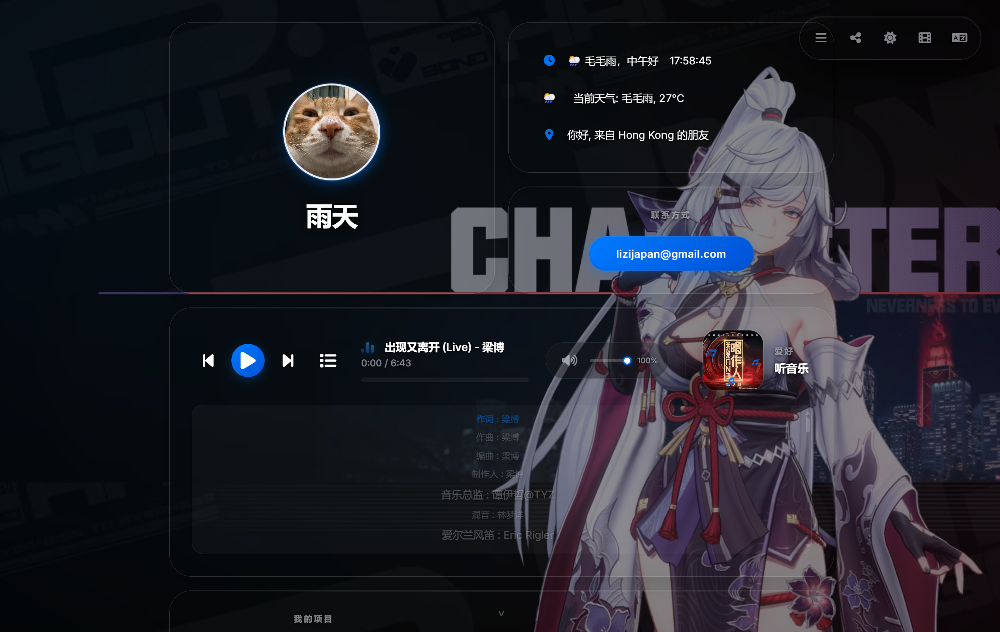

# 雨天的主页 (yutian.me)

个人动态交互式主页,部署于 [https://www.yutian.me](https://www.yutian.me)。

一个纯前端、零依赖的个人网站,集成了在线音乐播放器、个人简介、社交链接与兴趣爱好展示。深/浅色主题自适应,整体采用 Bento Grid(网格卡片)布局与 Liquid Glass(液态玻璃)视觉风格。

## 📷 截图预览

| 主页 | 我的项目 | 深色主题 |
|------|---------|---------|
|  |  |  |

## ✨ 功能特性

- 🎵 **在线音乐播放器** — 内置多首曲目,支持播放控制与音乐切换
- 🪞 **深/浅色主题** — 首次加载前应用主题,避免闪烁(FOUC),并跟随系统偏好
- 🧊 **Liquid Glass / Bento Grid 视觉** — 现代玻璃拟态 + 卡片网格布局
- 📱 **响应式设计** — 适配桌面与移动端
- 🔍 **SEO 优化** — 内置 canonical、OG 标签与 JSON-LD 结构化数据
- 📄 **robots.txt / sitemap.xml** — 面向搜索引擎的站点地图

## 🛠️ 技术栈

- 纯 HTML + CSS + JavaScript(无框架、无构建步骤)
- 静态部署,托管于 **Cloudflare Pages**

## 📂 目录结构

```
├── index.html        # 页面主体结构与元信息
├── style.css         # 样式(Bento Grid / Liquid Glass / 主题变量)
├── script.js         # 交互逻辑(播放器、主题、音乐列表)
├── bg_0.jpg          # 背景图
├── touxiang.PNG      # 头像
├── favicon.png       # 网站图标
├── robots.txt        # 爬虫协议
├── sitemap.xml       # 站点地图
├── README.md         # 项目介绍
├── .gitignore        # 忽略规则(音乐/视频等本地资源不入库)
└── screenshots/      # 网站截图
    ├── screenshot-1.png
    ├── screenshot-2.png
    └── screenshot-3.png
```

> 音乐(\.mp3/.flac)与视频(\.mp4)文件仅存在于本地,已通过 `.gitignore` 排除,不纳入版本管理。

## 🚀 本地运行

无需安装任何依赖,直接用浏览器打开 `index.html`,或启动本地静态服务器:

```bash
# 任选一种
python -m http.server 8000
# 或
npx serve .
```

## 📄 许可

仅作个人展示用途。
